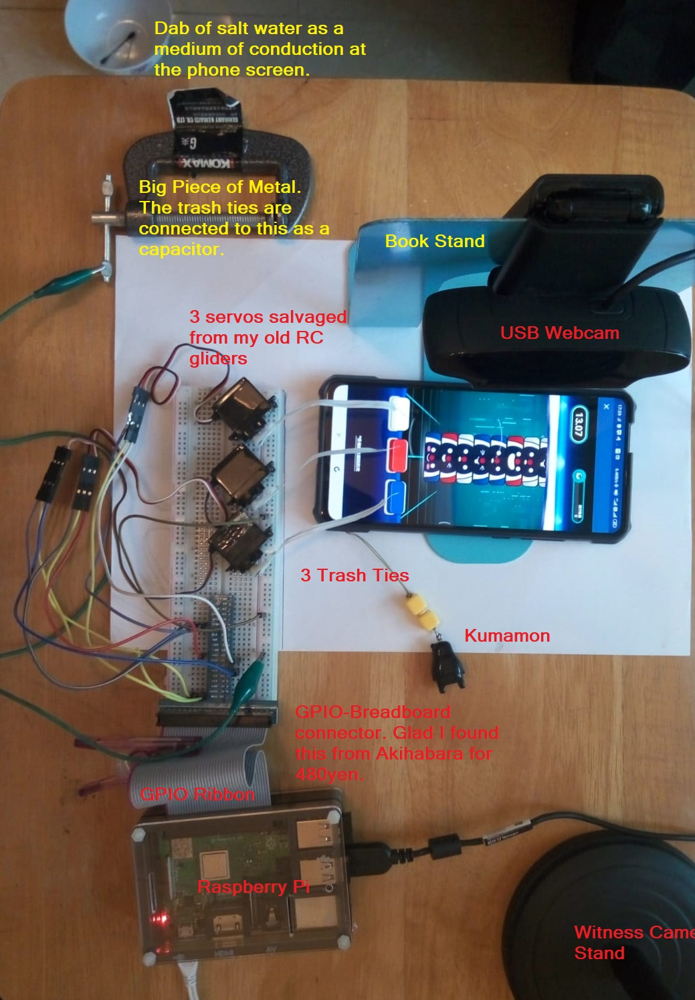

# Tap Tap Machine

So here is the story.

The goal of this mobile game is to beat the record by tapping the right color of the lowest block in a stack in order to remove that block.  The top 500 players every week get a HK$10 eqv. in train ticket.

I was stucked at around 6000, and got pushed further up the next day to 9000.  Then I realized the top players were remotely human because their scores were off the chart.  They had to be bots.

I wanted that HK$10 train ticket so bad ... so I built a robot too, not the kind that ran in the Android simulator but the actual Robot!  3 robotic arms that could tap the screen buttons according to the image from the webcam.

The biggest challenge in this project is the physical property of the tapping.  The dabs of salt water will react with the metal tip that touches the screen.  The rust built up at the tip must be cleaned regularly for the tapping to be precise.

The robot was finished in 3 evenings. My rank moved to 6000 on day 1, and 750 on day 2, and finally 64 on day 3.  Good enough unless another 400 bots surface to the top again.

## Day 7 of Week 1

My rank dropped to 191 at breakfast on the last day of the first week into the game.  I was still in the safe zone, but my wife was in the danger at rank 488.  She might get pushed off the cliff in a few hours.  We had to act fast to to get to the higher ground.

I might be experience in C++ but I am new to Python.  I had restructured my code from procedural to oo but the dtor concept wasn't just the same, so any Python reader might find my code amateur because I really didn't know how to write proper Python code.

The first thing I tweaked was about he GO! signal.  The game had stages and pauses in between.  At the start of a stage, the screen would show a block of white text that said READY! and then GO!.  I had struggled with starting manually too late or too soon with an invalid screen frame.  The algo must skip that frame if the white text was in it.  That was number one.  Surprisely this zero delay in each start of stage had helped to rank from 488 to 415.

The second thing tweaked was the timing of the arms tapping because the arms did tap well most of the time but some error would occur and killed the game.  Why!?  Slowing down the arm movement would have significant impact to the overall score.  The best solution in these situations was a tea break.

I swapped to play the game with my phone and immediately it played a perfect game.  So I concluded it was the dab of salt water again.  Though the contact was made, the capacitative property had deteoriated over time.  That explained why the game played well on switching phones with a fresh dab of salt water.

Enough talk.  Wife's game went from 488 to 415.  Mine went from 191 to 26.  Swapping back to her phone ... rank no. 6.  I was deliriously happy with this achievement.  That was a big Green Crab!!

We called the HK$20 bill "green crab."
